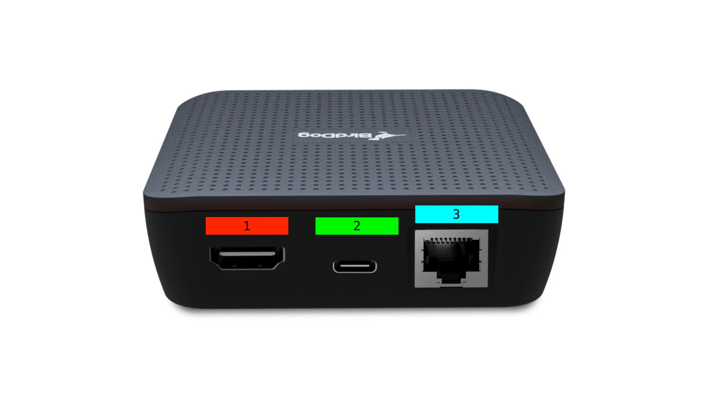

# Stream Decoders

## Stream Decoder Setup

1. Determine the BirdDog device's specified location. Wood/Metal shop devices will be placed on top of the projector, the cave device will be affixed to the rear of the cave TV in the commons, and the arena device will be affixed to the rear of the central arena TV.
2. Plug the HDMI cable into the TV/Projector, and then into the back of the BirdDog on port 1
3. Plug the PoE splitting adapter into ports 2 and 3 on the BirdDog
4.  If the network run is set up, plug the other side of the adapter into the network run. If not, leave as is until the network is set up

    <figure><figcaption></figcaption></figure>

<figure><figcaption></figcaption></figure>
